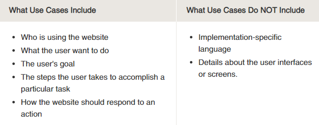

# User and Epic Stories

## Use Cases
- A use case is a methodology used in system analysis to identify, clarify and organize system requirements. The use case is made up of a set of possible sequences of interactions between systems and users in a particular environment and related to a particular goal. The method creates a document that describes all the steps taken by a user to complete an activity.

## User Stories
- A user story is an informal, general explanation of a software feature written from the perspective of the end user. Its purpose is to articulate how a software feature will provide value to the customer.

- A key component of agile software development is putting people first, and a user story puts end users at the center of the conversation. These stories use non-technical language to provide context for the development team and their efforts. After reading a user story, the team knows why they are building, what they're building, and what value it creates. 

 - Generally a story is written by the product owner, product manager, or program manager and submitted for review.

### User stories in Agile

- A user story is the smallerst unit of work in an agile framework.

- User stories are a few sentences in simple language that outline the desired outcome.

-  In scrum, user stories are added to sprints and “burned down” over the duration of the sprint. Kanban teams pull user stories into their backlog and run them through their workflow. It’s this work on user stories that help scrum teams get better at estimation and sprint planning, leading to more accurate forecasting and greater agility. 

### Benefits of user stories
- Stories keep the focus on the user - a collection of stories keeps the team focused on solving problems for real users.
- Stories enable collaboration - With the end goal defined, the team can work together to decide how best to serve the user and meet that goal.
- Stories drive creative solutions - stories encourage the team to think critically and creatively about how to best solve for an end goal.

## Epic Stories
- Epics are large bodies of work that can be broken down into a number of smaller tasks (called stories).

- Epics are almost always delivered over a set of sprints. As a team learns more about an epic through development and customer feedback, user stories will be added and removed as necessary. 

### Epic Stories in Agile
 - Epics are large work items broken down into a set of stories, and multiple epics comprise an initiative. These larger structures ensure that the day to day work of the development team contributes to the organizational goals built into epics and initiatives.
 
 - That’s the key with agile epics: Scope is flexible, based on customer feedback and team cadence.

 

